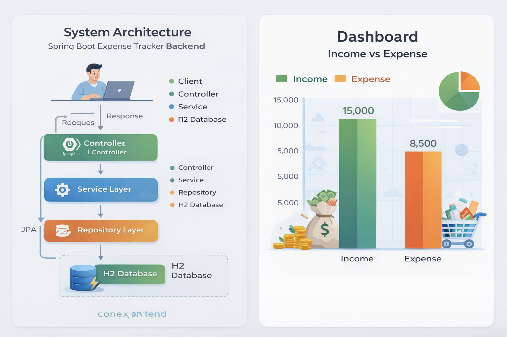
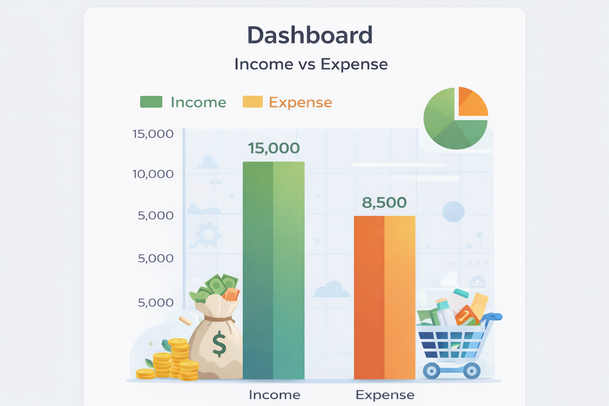
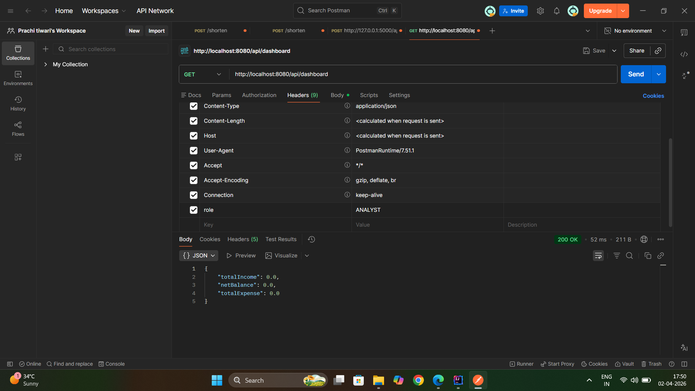

# 💰 Expense Tracker Backend (Spring Boot)

## 🚀 Project Highlights

* Clean layered architecture (Controller → Service → Repository)
* Role-Based Access Control (RBAC) without Spring Security
* Real-time dashboard analytics (income, expense, net balance)
* Designed with scalability and clarity in mind

---

## 🧠 System Architecture




**Flow:**
Client → Controller → Service → Repository → Database (H2)

---

## 📌 Overview

This project is a **Spring Boot backend system** for managing financial transactions.
It supports **expense tracking, role-based access control**, and **dashboard analytics**.

Users can:

* Add expenses/income
* Filter data by category
* View summaries (income, expense, balance)

---

## ⚙️ Tech Stack

* Java (Spring Boot)
* Spring Data JPA
* H2 In-Memory Database
* Maven

---

## 🚀 Features

* 🔐 Role-Based Access Control (ADMIN, ANALYST, VIEWER)
* 📊 Dashboard analytics API
* 📁 Expense CRUD operations
* 🔎 Category-based filtering
* ⚡ Clean architecture

---

## 👥 Roles & Permissions

| Role    | Permissions          |
| ------- | -------------------- |
| ADMIN   | Create, Delete, View |
| ANALYST | View + Dashboard     |
| VIEWER  | View only            |

---

## 📡 API Endpoints

### 🧾 Expense APIs

| Method | Endpoint                              | Access         |
| ------ | ------------------------------------- | -------------- |
| POST   | `/api/expenses`                       | ADMIN          |
| GET    | `/api/expenses`                       | ALL            |
| GET    | `/api/expenses/category?category=...` | ADMIN, ANALYST |
| DELETE | `/api/expenses/{id}`                  | ADMIN          |

---

### 📊 Dashboard API

| Method | Endpoint         | Access         |
| ------ | ---------------- | -------------- |
| GET    | `/api/dashboard` | ADMIN, ANALYST |

---

## 📊 Dashboard Visualization



---

## 🧪 API Testing (Postman Screenshots)

### ✅ Create Expense


### ✅ Get All Expenses


### ✅ Filter by Category


### ✅ Dashboard Summary



---

## 🗄️ Database

* Uses **H2 in-memory database**
* No setup required
* Data resets on restart

---

## ▶️ How to Run

1. Clone the repository
2. Open in IntelliJ / VS Code
3. Run `ExpenseTrackerApplication.java`
4. Test APIs using Postman

---

## 🔐 Request Header

All APIs require role:

```
role: ADMIN
```

---

## 🧠 Design Approach

* Followed **layered architecture**
* Separation of concerns:

  * Controller → API handling
  * Service → Business logic
  * Repository → Data access
* Manual RBAC implementation for simplicity

---

## 📁 Project Structure

```
com.expensetracker
│── controller
│── service
│── repository
│── model
│── util
```

---

## ✍️ Author

**Prachi Tiwari**
